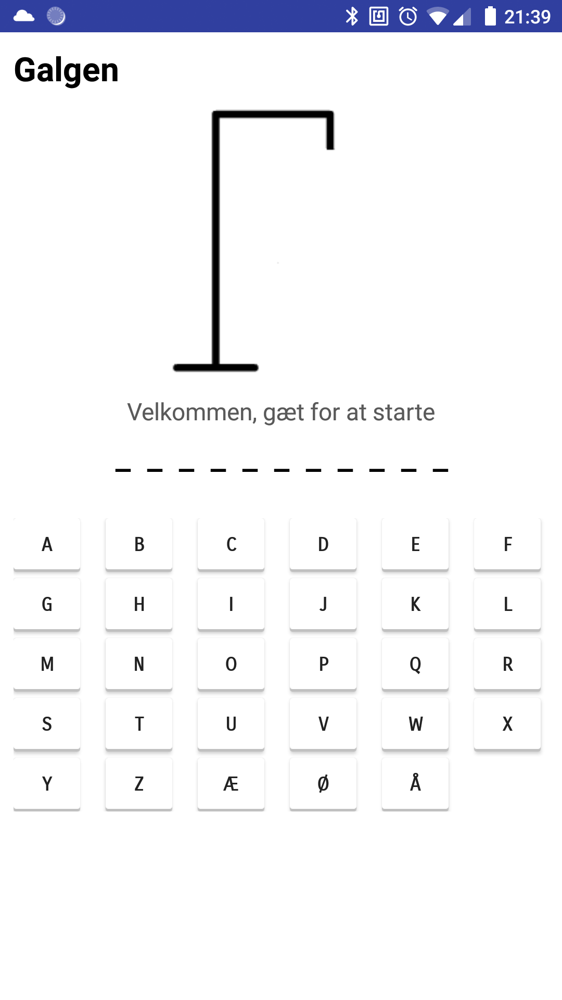
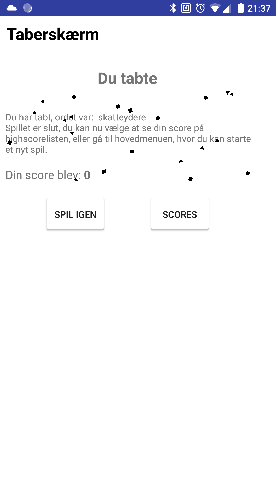
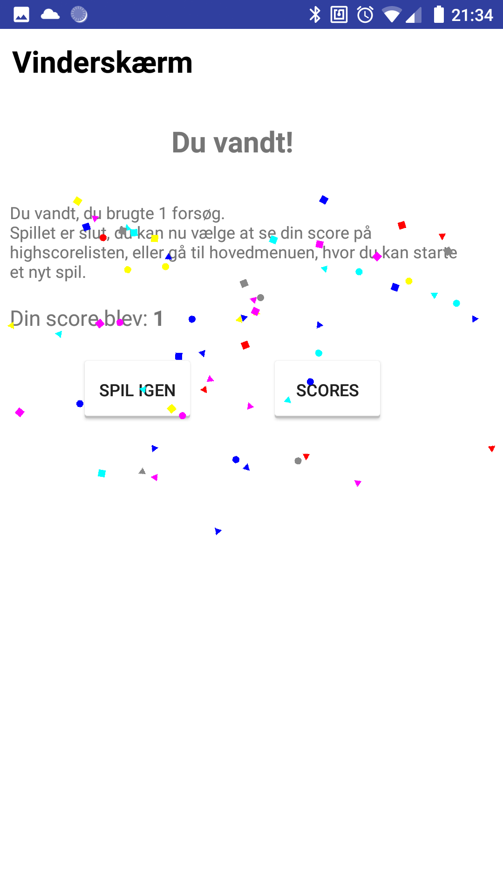

# GalgelegAflevering
Nyt repo. Hele projektet er blevet refreshed, nyt repo fordi der gik ged i det gamle.
Galgeleg er et projekt vi skulle aflvere i 3. semester i faget Brugerinteraktion og Design BRINT, det er en Android App.  
Vejledere: Jacob Nordfalk & Ian Bridgwood

Nedenfor er screenshots af hvordan appen ser ud på min emulator og telefon:

